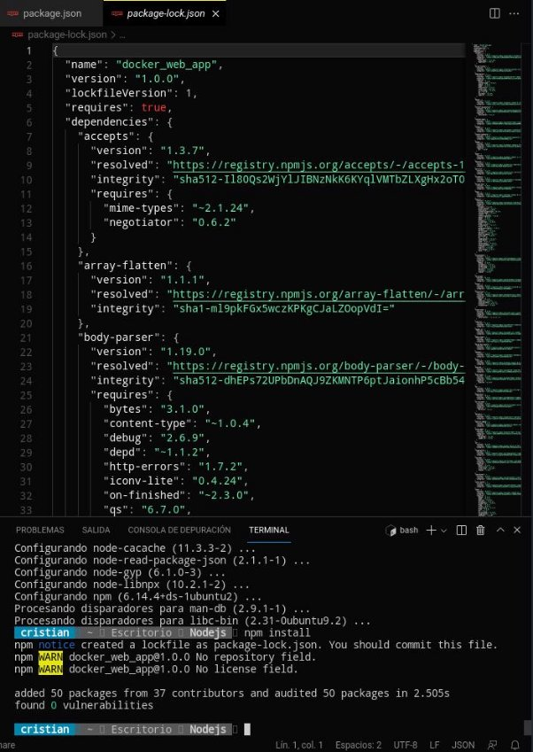
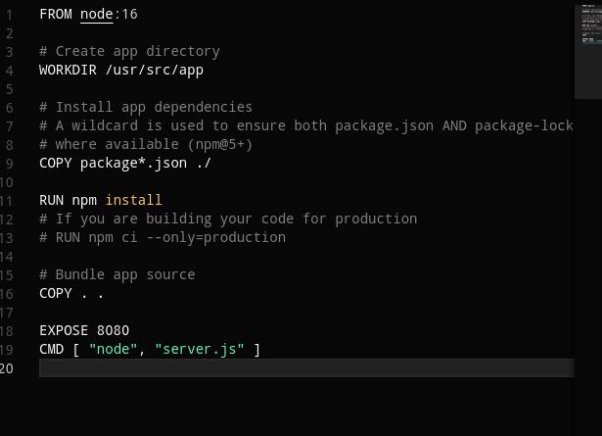

Cristian León Méndez

# Desplegar una aplicación de Node js con Docker

## Crear la aplicación de nodejs

Lo primero que haremos será crearnos una carpeta donde pondremos todos los ficheros que necesitamos para poder desplegar la aplicación.

Una vez estemos dentro.Crearemos el primer fichero que será un **package.json** donde describirá nuestra aplicación y las dependencias que necesitaremos.El contenido del archivo debé ser el siguiente:

Cuando hayamos puesto el contenido en el package.json.Deberemos abrir una terminal y ejecutar el comando **npm install (**Deberás tener una version de npm 5 o superior**).** Este comando nos generará todas las dependencias y un archivo **package-lock.json** que será el que se copiara en la imagen de docker

Ahora creamos otro fichero llamado **server.js** que definirá que queremos usar **Express.js:**

## Crear el dockerfile

Creamos un archivo dockerfile donde debemos poner lo siguiente:

Construir la imagen de docker

Para construir la imagen de docker una vez haber hecho todo lo anterior del informe,debemos ejecutar el siguiente comando:

**docker build . -t tunombre/node-web-app**

Si esta ha funcionado correctamente,nos dará el siguiente resultado a ejecutar el comando **sudo docker images**

## Arrancar la imagen

Para arrancar la imagen lo que debemos hacer es ejecutar el comando **docker run -p 49160:8080 -d tunombre/node-web-app**

## Resultado de Testeo

