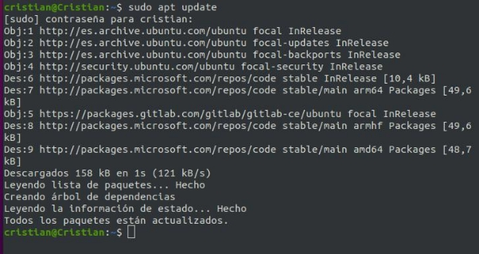
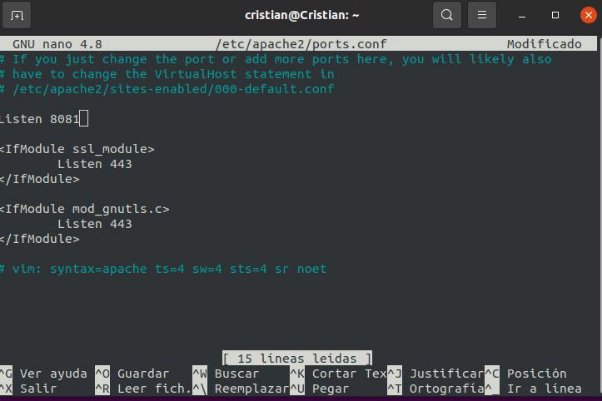
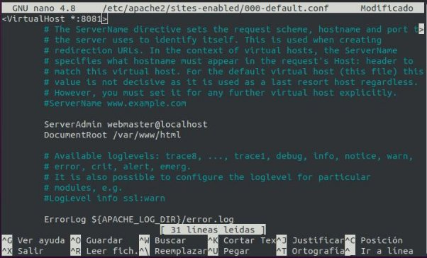
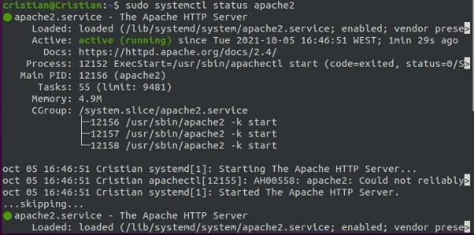
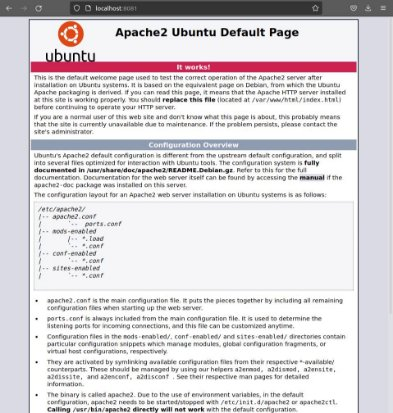

# Instalación de Apache en Linux

En este informe aprenderás a instalar el servicio web de Apache en una maquina Ubuntu, en el caso del informe esta testeado en una maquina Ubuntu 20.04

¿Qué es Apache?

Apache es el servicio Web de código abierto más popular.

Actualizar el sistema

Lo primero que debemos hacer para que la instalación sea lo más correcta posible y tengamos los minimos problemas posibles, para ello debemos usar dos comandos.El primero que usaremos será el que sirve para actualizar los repositorios.

**sudo apt update**

Lo siguiente que haremos será actualizar las aplicaciones que tenemos en la maquina y que no haya conflictos a la hora de instalar Apache.

**sudo apt upgrade**

Instalación de Apache en Ubuntu

A continuación lo que haremos será ejecutar el codigo que nos instala la ultima version de apache que tenemos en nuestros repositorios oficiales de Ubuntu.

**sudo apt install apache2**

Lo más probable que nos pasé es que nos encontremos con los siguientes mensajes de error:

Para solucionar esto haremos lo siguiente:

Debemos entrar al archivo de configuración de los puertos de apache con el siguiente comando:

**sudo nano /etc/apache2/ports.conf**

Una vez dentro debemos de cambiar **Listen 80** por **Listen 8081**

Además de entrar en este archivo debemos de entrar también a otro y cambiar donde pone **80** por **8081**

**sudo nano /etc/apache2/sites-enabled/000-default.conf**

Estos problemas aparecerán por el hecho de que GitLab y Apache estaban utilizando el mismo puerto.

Una vez hecho esto nos aseguraremos de que los cambios funcionan con los siguientes comandos

**sudo systemctl restart apache2**

**sudo service apache2 restart**

Ahora tenemos que ajustar el firewall.

Lo primero que además será mirar los perfiles que tiene por defecto de Apache **sudo ufw app list**

Lo que haremos ahora será activar por defecto el servidor apache y no nos pida usar una conexión cifrada.Para ello usaremos el siguiente comando

**sudo ufw allow ‘Apache’**

Verificamos ahora los perfiles activos.El resultado debería ser parecido al siguiente:

Por ultimo verificaremos que está activo el servicio Apache con el siguiente comando: **sudo systemctl status apache2**

Acceso

Para poder acceder a nuestro servicio apache debemos hacerlo de dos maneras.Poniendo tu ip en el navegador junto al puerto apache

**En mi caso será 10.0.2.15:8081**

La otra manera es poniendo **localhost:8081**

Si todo está bien debería salirte la pantalla de la siguiente captura

