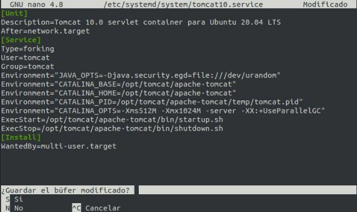
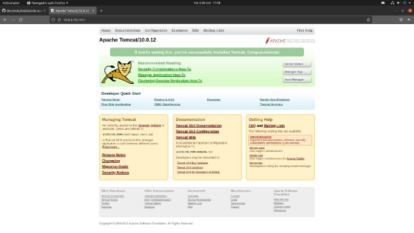

Cristian León Méndez

# Instalación de Apache-Tomcat en Linux

En el informe de a continuación vamos a instalar el servicio web de Apache-Tomcat en una máquina Ubuntu 20.04 para poder desplegar aplicaciones Java.

Actualización de los repositorios

Antes de comenzar con la instalación deberemos tener nuestra máquina actualizada.Para ello ejecutaremos los dos comandos que siempre utilizamos para esto.

**sudo apt update sudo apt upgrade**

Instalación de Apache-Tomcat

Lo primero que debemos hacer para la instalación es descargarnos la ultima versión de apache. Lo podemos hacer de dos formas.

La primera opción es ir a la página oficial de apache tomcat, ir al apartado de descargas y descargar la última versión estable disponible.

La otra opción es ejecutar el siguiente comando que lo hace es ir a los repositorios de apache y coger la versión 10.0.12 que es la más estable ahora mismo para Ubuntu

**wget [https://downloads.apache.org/tomcat/tomcat-10/v10.0.12/bin/apache-tomcat-10.0.12.ta r.gz**](https://downloads.apache.org/tomcat/tomcat-10/v10.0.12/bin/apache-tomcat-10.0.12.tar.gz)**

En este caso vamos a instalarlo de manera que entraremos con un usuario y grupo personalizado para este servicio por lo que debemos hacer lo siguiente:

Lo primero de todo será crear el usuario personalizado llamado Tomcat.Esto lo haremos con el siguiente comando:

**sudo useradd -U -m -d /opt/tomcat -k /dev/null -s /bin/false tomcat**

Lo siguiente que debemos hacer para una instalación correcta será descomprimir el archivo que nos descargamos en el primer p./img/Aso, lo descomprimimos en la ubicación definitiva para el programa:

**sudo tar xf apache-tomcat-10.0.12.tar.gz -C /opt/tomcat/**

Después de esto debemos renombrar el directorio de la instalación a uno que no tenga numeros de version para facilitarnos a la hora de poder crear enlaces simbólicos

Esto lo haremos ejecutando el siguiente comando

**sudo ln -s /opt/tomcat/apache-tomcat-10.0.12/ /opt/tomcat/apache-tomcat**

Una vez haber creado el enlace simbólico deberemos crear el archivo de configuración con el siguiente comando

**sudo nano /etc/systemd/system/tomcat10.service**

Se nos abrirá el nano que es un editor de codigo en el que debemos pegar el siguiente contenido:

**[Unit]**

**Description=Tomcat 10.0 servlet container para Ubuntu 20.04 LTS After=network.target**

**[Service]**

**Type=forking**

**User=tomcat**

**Group=tomcat**

**Environment="JAVA\_OPTS=-Djava.security.egd=file:///dev/urandom" Environment="CATALINA\_BASE=/opt/tomcat/apache-tomcat" Environment="CATALINA\_HOME=/opt/tomcat/apache-tomcat" Environment="CATALINA\_PID=/opt/tomcat/apache-tomcat/temp/tomcat.pid" Environment="CATALINA\_OPTS=-Xms512M -Xmx1024M -server -XX:+UseParallelGC" ExecStart=/opt/tomcat/apache-tomcat/bin/startup.sh ExecStop=/opt/tomcat/apache-tomcat/bin/shutdown.sh**

**[Install]**

**WantedBy=multi-user.target**

Una vez hayamos pegado el contenido debemos pulsar **CTRL +X** y **enter** para que se guarden los cambios del archivo **.**

Cuando hayamos guardado los cambios nos quedaría comprobar que todo ha funcionado correctamente.Para esto ejecutaremos unos cuantos comandos:

EL primero será para iniciar el servicio

**sudo systemctl start tomcat10**

El segundo comando sirve para mirar si se ha iniciado correctamente: **systemctl status tomcat10**

Por último el comando que viene a continuación sirve para que se inicie el servicio automáticamente se inicie la máquina

Acceso a Apache-Tomcat

Una vez hecho esto solo nos queda intentar acceder a Apache Tomcat de la siguiente manera:

Debemos iniciar un navegador y poner nuestra IP seguido de el puerto que se la por defecto.Que es el 8080.En mi caso sería lo siguiente.

**10.0.2.15:8080**

Si todo funciona correctamente,ya podremos usar Apache-Tomcat en nuestra máquina.
