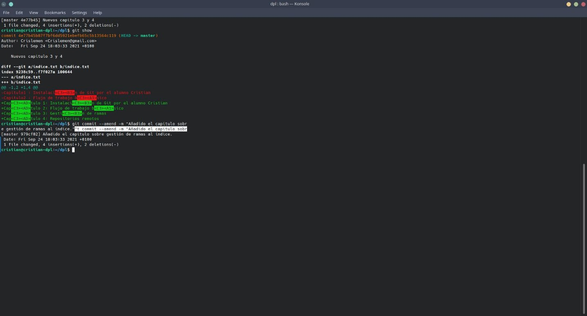

Cristian León Méndez

# Manipulación de repositorios en Git

## Introducción

En este informe te enseñaremos a crear y manipular repositorios de Git con los siguientes pasos.

## Creación de un repositorio

Para crear un repositorio en Git debemos hacer los siguientes pasosç

- El primer paso que debemos hacer es abrir una terminal
- Lo siguiente que haremos será ejecutar las siguientes lineas de comandos que se ven en la siguiente captura:

El primer comando nos sirve para crear la carpeta **dpl,** el siguiente comando nos hace meternos dentro de esta carpeta,el siguiente hace que inicializamos la carpeta para que sea un repositorio de git y por ultimo confirmamos que se ha creado la rama master en el directorio.

## Comprobar el estado del repositorio

A continuación vamos a crear un nuevo archivo llamado **indice.txt** y añadiremos texto de ejemplo.para ello lo vamos a hacer con **cat > indice.txt**

Despues de haber puesto texto dentro del fichero pulsaremos **CTRL + D** para salir del editor Comprobamos el estado del repositorio ahora con **git status.**Como veremos en la siguiente captura el archivo saldrá en rojo,esto significa que no estan subidos los archivos o que no estan añadidos en el repositoro de GIt.Para que esten en este debemos hacer el comando **git add indice.txt.** Ahora comprobamos de nuevo el estado del repositorio y veremos que habrá cambiado a verde.

## Realizar un commit

Un commit se realiza para especificar que cambio has hecho en el fichero o en el directorio. para esto se usa el siguiente comando **git commit -m “Texto que se agrega al commit”**

Ahora cuando miramos el estado del repositorio nos dice que no hay nada que comentar.

## Modificación de ficheros

Ahora haremos un ejemplo de cambiar el fichero,lo que haremos será entrar en el fichero que hemos creado antes con el mismo comando **cat > indice.txt.**

Una vez editado el archivo debemos mirar la diferencia que hemos hecho en el archivo con el comando **git diff.**Despues de ver las diferencias del archivo debemos añadirlo de nuevo con un **git add .** y un **git commit** para comentar los cambios de este

## Historial

Para ver el historial de cambios que hemos hecho en el repositorio bastaría solo con poner **git show**

Otra cosa que podemos hacer con el commit es cambiar el ultimo commit que hemos añadido con el comando **git commit --amend -m “Texto”**
